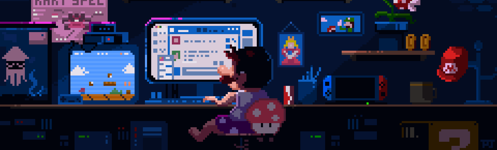

# 👋 Olá! Eu sou Gustavo Ferreira Santos



💻 Estudante apaixonado por **Tecnologia, Programação e Robótica**.

Atualmente, estou desenvolvendo meus conhecimentos em programação e participando de projetos que unem **criatividade, tecnologia e trabalho em equipe**. Gosto de aprender coisas novas, enfrentar desafios e transformar ideias em projetos reais.

---

## 🚀 Sobre mim

- 🎓 Estudante do Ensino Médio
- 🤖 Participante e mentor de **Robótica**
- 🏆 Integrante da equipe **Subnautico's**
- 🧩 Participante da **FIRST LEGO League (FLL)**
- 🔧 Experiência com **Arduino e eletrônica**
- 💻 Estudando **Python, JavaScript, HTML e CSS**
- 🐧 Explorando **Linux e servidores**
- 📚 Sempre buscando aprender algo novo

---

<h2 align="center">🛠️ Tecnologias e Ferramentas</h2>

<p align="center">
  
</p>

---

## 🤖 Robótica

A robótica é uma das áreas que mais me inspira.

Faço parte da equipe **Subnautico's**, participando de competições da **FIRST LEGO League**. Ao longo dessa jornada, tive a oportunidade de atuar tanto como **competidor quanto como mentor**, ajudando outros integrantes a aprender e evoluir.

Para mim, robótica não é apenas construir e programar um robô. É sobre:

> **Aprender, errar, melhorar e trabalhar em equipe para transformar uma ideia em realidade.**

---

## 🔭 Atualmente estudando

```text
🐍 Python
⌨️ PHP
🟨 JavaScript
🌐 HTML + CSS
🔌 Arduino
🤖 Robótica
🐧 Linux
🗄️ Banco de Dados
🔗 APIs
